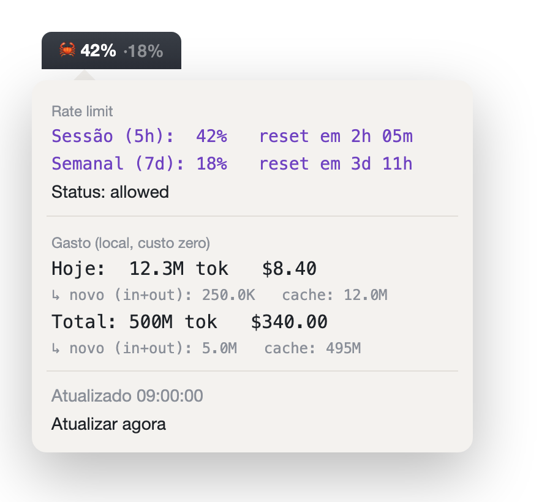

# CrabBar 🦀 — Claude Code na barra de menus

Seus limites do **Claude Code** na barra de menus do Mac, do lado do relógio — sempre à vista, **sem gastar token nenhum** e sem hardware.

Você planeja o dia em cima dos seus limites. Ficar abrindo o `/usage` toda hora cansa. O CrabBar põe o número onde você sempre vê.



```
🦀 5h 14% · 7d 73%              ← título: cada limite que a sua conta tem
────────────────────────────
Limites (% usado)
Sessão (5h):                14%   reset em 4h 00m
Semanal · todos os modelos: 73%   reset em 2d 10h
Semanal · Fable:             9%   reset em 5d 02h     ← aparece sozinho quando existe
Fonte: /api/oauth/usage — zero token
────────────────────────────
Gasto (local, custo zero)
Hoje:  1.2M tok   $0.00
Total: 8.4M tok   $0.00
────────────────────────────
Atualizado 09:00:00
Atualizar agora
```

> Os números acima são ilustrativos. O plugin lê **os seus** dados na sua máquina.

## Gasta meus tokens ou créditos? Não.

O `%` dos limites vem de `GET /api/oauth/usage` — **o mesmo endpoint que o `/usage` do Claude Code e a rodinha de uso leem**. Ele **não invoca modelo**, então custa **zero token e zero crédito**. Acompanhar o uso não consome uso nenhum.

Ele **descobre sozinho todos os limites** que a Anthropic reporta pela sua conta, pelo nome: sessão de 5h, semanal de todos os modelos, e os por-modelo (**Fable**, Opus, Sonnet…). Se a Anthropic criar um limite novo, ele aparece automaticamente — nada pra configurar.

## Instalação

### Do jeito fácil: peça pro Claude Code

Abra o Claude Code na pasta que quiser e cole este prompt:

> Instale o CrabBar pra mim: clone `https://github.com/anagesoares/crabbar` (ou entre na pasta se eu já tiver baixado), rode `./install.sh`, e se algo falhar, conserte e tente de novo. Termine só quando o 🦀 estiver visível na minha barra de menus.

O Claude Code faz o resto e te avisa quando os números estiverem no ar.

### Prefere o terminal? Um comando:

```bash
git clone https://github.com/anagesoares/crabbar
cd crabbar
./install.sh
```

Instala o SwiftBar (se faltar), aponta a pasta de plugins pra `plugins/`, **registra o SwiftBar pra abrir sozinho no login** e abre o app. É idempotente — pode rodar de novo à vontade.

**Na 1ª execução** o macOS pode pedir pra **permitir o acesso ao Keychain** (item `Claude Code-credentials`) — clique em *Permitir sempre*. Negar impede a leitura do login e o contador não funciona.

## Pré-requisitos

- macOS + [SwiftBar](https://github.com/swiftbar/SwiftBar) (o `install.sh` instala via Homebrew se faltar).
- **Claude Code** logado numa conta **Pro ou Max** (é de onde vem o login no Keychain). Não funciona com API key avulsa, Bedrock ou Vertex.
- Só pro **gasto** local (opcional): Node/`npx` no PATH. Mais rápido: `npm i -g ccusage`.

## Duas fontes de dados, as duas de graça

| Seção | Fonte | Custo |
|---|---|---|
| **Limites** (5h, semanal, por-modelo) | `GET /api/oauth/usage` (mesmo do `/usage`) | **zero token / zero crédito** |
| **Gasto** (tokens/$) | `ccusage -j` lê `~/.claude/projects/**/*.jsonl` localmente | **zero** (nem chama a API) |

## Nunca fica na mão (resiliência)

- **Último valor bom em cache** (`~/.cache/crabbar/`): se você ficar offline ou a API der soluço, ele mostra o último número com um **⏳** em cinza, em vez de apagar tudo.
- **Retry + backoff**: re-tenta erros transitórios e, se levar `429` de propósito, recua uns minutos servindo o cache — sem martelar a API.
- **Auto-refresh do token** (opcional): se o login expirar, renova sozinho pelo fluxo OAuth oficial da Anthropic e regrava no Keychain — o mesmo que o Claude Code faz. **Desligado por padrão**; ligue com `CRAB_AUTO_REFRESH=1`.

## Variáveis de ambiente

| Var | O que faz |
|---|---|
| `CRAB_SHOW=remaining` | Mostra % **restante** em vez de usado |
| `CRAB_WARN` / `CRAB_CRIT` | Thresholds de cor (default `75` / `90`) |
| `CRAB_AUTO_REFRESH=1` | Liga o auto-refresh do token OAuth (faz backup do Keychain antes de regravar) |
| `CRAB_NO_PING=1` | Desliga a leitura de limites (fica só o gasto local) |
| `CRAB_CCUSAGE_CMD="..."` | Comando alternativo do ccusage |

Definir pro SwiftBar, por exemplo:

```bash
defaults write com.ameba.SwiftBar CRAB_SHOW -string remaining
```

## Exibição na barra

Clique no 🦀 → **Exibição na barra** e escolha como o título aparece:

| Modo | Fica assim |
|---|---|
| **Só percentual** | `🦀 23% · 74%` |
| **Janela (5h · 7d)** | `🦀 5h 23% · 7d 74%` |
| **Percentual + reset** | `🦀 23% 3h0m  74% 2d` — quanto falta pro reset, ao lado do % |

A escolha fica salva em `~/.cache/crabbar/prefs.json`.

## Cores

roxo `< 75%` · âmbar `75–89%` · vermelho `≥ 90%`, aplicadas a cada limite **no dropdown**. Thresholds configuráveis (`CRAB_WARN`/`CRAB_CRIT`).

## Ajustar o intervalo

Renomeie o arquivo em `plugins/`: `crabbar.5m.py` (5 min), `crabbar.30s.py` (30 s), etc. Como a leitura é zero token, atualizar com frequência **não custa nada**.

## Por que o plugin fica numa subpasta `plugins/`

O SwiftBar **roda todo arquivo executável** da pasta que monitora — e ainda força `+x` nele (opção `MakePluginExecutable`). Se `README.md` ou `install.sh` ficarem junto, ele tenta executá-los como plugin e aparece um **"?"** no menu. Por isso o plugin mora sozinho em `plugins/`, e o resto fica na raiz, fora do alcance dele.

## Abrir no login

O `install.sh` adiciona o SwiftBar aos **Itens de Início** do macOS, então ele volta sozinho depois de reiniciar. Se sumir da barra depois de um reboot, basta `open -a SwiftBar`. Conferir/remover em *Ajustes do Sistema → Geral → Itens de Início*.

## Sumiu da barra? (o que fazer)

Quase sempre é o SwiftBar que não está rodando — ele não abriu no login, ou você fechou sem querer.

1. **Recuperação em 1 comando** — resolve a maioria dos casos:
   ```bash
   cd ~/Projects/clawdmeter-swiftbar   # a pasta onde você clonou
   ./install.sh
   ```
   O `install.sh` é idempotente: reaponta o SwiftBar pra `plugins/`, garante o login e **reabre o app**. Pode rodar quantas vezes quiser.

2. **Só reabrir o SwiftBar** (se preferir): `open -a SwiftBar`. Se o ícone 🦀 sumiu mas o do SwiftBar está lá, force um reload: `killall SwiftBar && open -a SwiftBar`.

3. **Apareceu um "?" no lugar do 🦀?** O SwiftBar tenta executar *todo* arquivo da pasta de plugins — um `__pycache__/` ou qualquer arquivo extra ali vira um "plugin" quebrado. Limpe e recarregue:
   ```bash
   rm -rf ~/Projects/clawdmeter-swiftbar/plugins/__pycache__
   killall SwiftBar && open -a SwiftBar
   ```

4. **Só some quando você troca de app (aparece num, some noutro)?** Não é o CrabBar fechando — é o **notch** do MacBook. Quando o app da frente tem muitos menus no topo (navegadores têm um monte), eles crescem até o notch e o macOS **esconde os ícones da direita atrás dele**. Dois jeitos de resolver:
   - **Grátis e na hora:** segure **⌘ (Cmd)** e **arraste o 🦀 pra bem perto do relógio**. Os ícones somem da esquerda pra direita quando o espaço aperta, então quanto mais à direita, mais difícil de sumir.
   - **Definitivo:** instale um gerenciador de barra de menus como o [Ice](https://github.com/jordanbaird/Ice) (grátis, open-source) — ele guarda os ícones que não cabem num menuzinho, e o 🦀 nunca mais some, seja qual for o app.

> **Dica:** o SwiftBar lê o plugin direto da pasta `plugins/` **do repo** (é pra lá que o `install.sh` aponta). Não precisa copiar o `.py` pra dentro de `~/Library/Application Support/SwiftBar/` — se você tiver cópias antigas lá, o SwiftBar nem as usa; rodar `./install.sh` já deixa tudo apontado pro lugar certo.

## Isto é não-oficial

Ferramenta independente, **não** feita nem endossada pela Anthropic. "Claude" é marca da Anthropic, citada só pra descrever compatibilidade. Lê o endpoint de uso da Anthropic; se a Anthropic mudar esse endpoint, o parser (escrito de forma defensiva) pode precisar de um ajuste.

## Créditos

**Autora:** [Ana G. Soares](https://instagram.com/ana.gsoares). Adaptação "software-only" (barra de menus, sem hardware) do [Clawdmeter](https://github.com/HermannBjorgvin/Clawdmeter) de Hermann Björgvin, que roda numa placa ESP32. Licença MIT.
